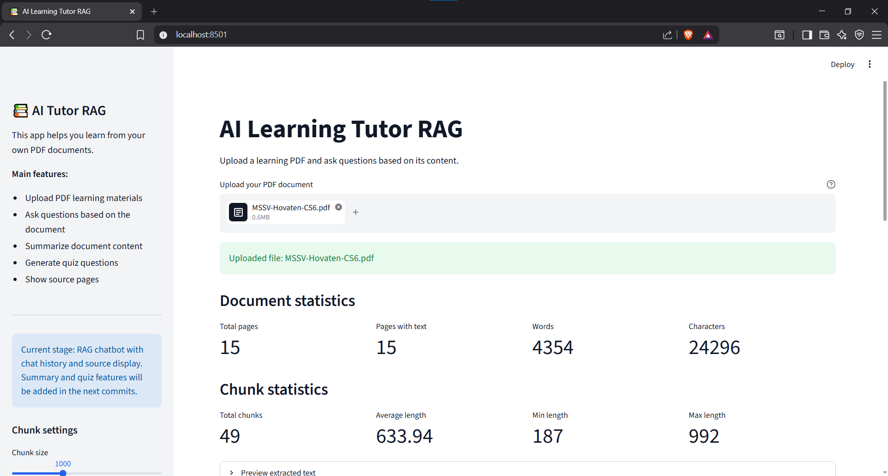
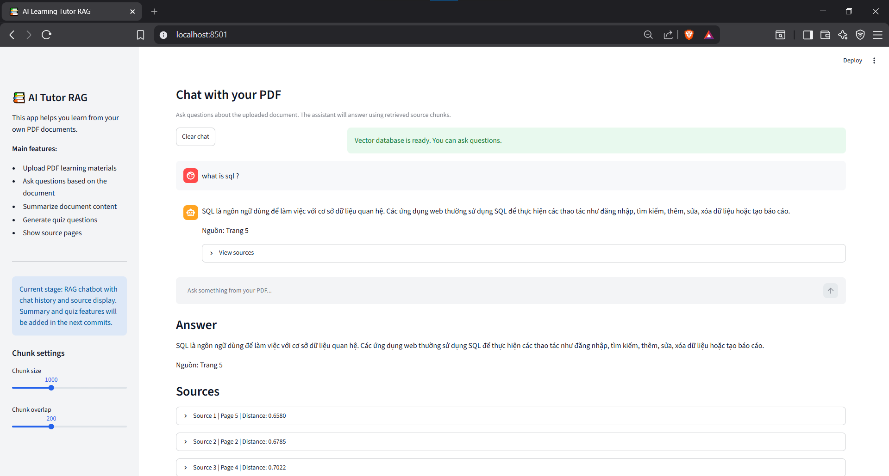
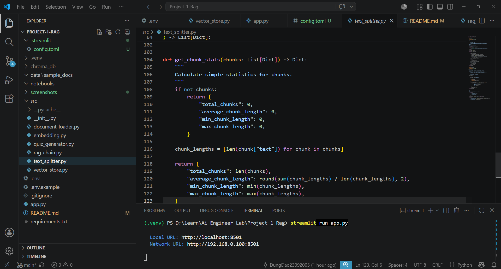
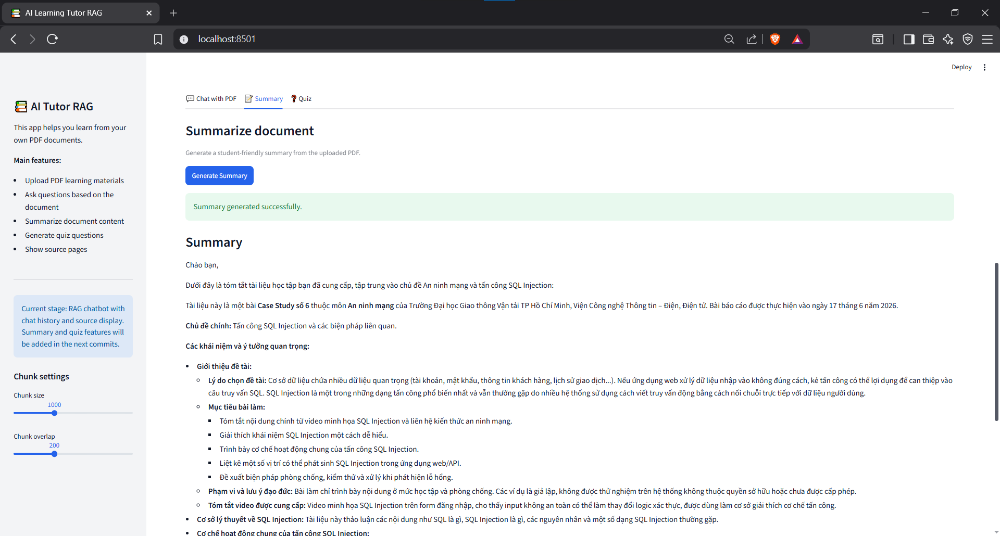
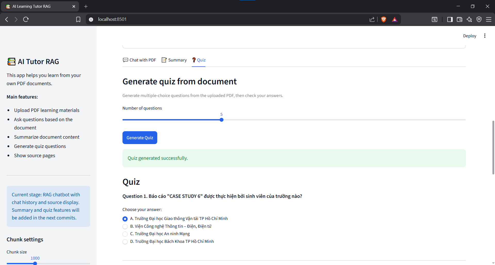
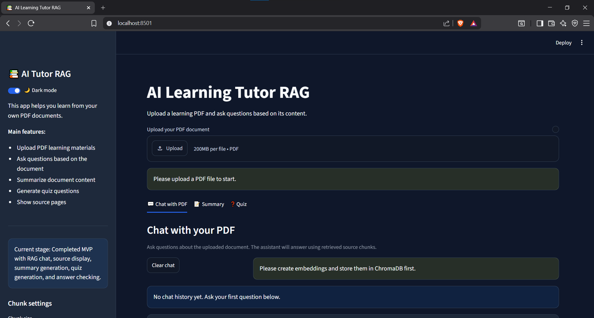

# AI Learning Tutor RAG

AI Learning Tutor RAG is a personal AI project that helps students learn from their own PDF documents using Retrieval-Augmented Generation (RAG).

Users can upload a learning PDF, ask questions about the document, generate summaries, create multiple-choice quizzes, and view the source pages used by the assistant.

This project was built as a portfolio project for AI Engineer / Machine Learning Engineer internship applications.

---

## Demo Features

- Upload PDF learning materials
- Extract text from PDF pages
- Split document text into page-aware chunks
- Create embeddings for document chunks using Gemini
- Store and search embeddings with ChromaDB
- Ask questions based on uploaded PDF content
- Generate source-grounded RAG answers
- Display source chunks and page numbers
- Generate document summaries
- Generate multiple-choice quizzes
- Check quiz answers and explain mistakes
- Store chat history in the app session
- Light and dark mode toggle

---

## Tech Stack

- Python
- Streamlit
- Gemini API
- ChromaDB
- PyPDF
- python-dotenv
- Docker
- Docker Compose

---

## Project Architecture

```text
User uploads PDF
        ↓
Extract text from PDF pages
        ↓
Split text into chunks
        ↓
Create embeddings for chunks
        ↓
Store embeddings in ChromaDB
        ↓
User asks a question
        ↓
Create embedding for the question
        ↓
Retrieve relevant chunks from ChromaDB
        ↓
Send context + question to Gemini
        ↓
Generate answer based on document context
        ↓
Display answer with source pages
```

---

## Folder Structure

```text
ai-learning-tutor-rag/
│
├── app.py
├── requirements.txt
├── Dockerfile
├── docker-compose.yml
├── README.md
├── .env.example
├── .gitignore
│
├── src/
│   ├── __init__.py
│   ├── document_loader.py
│   ├── text_splitter.py
│   ├── embedding.py
│   ├── vector_store.py
│   ├── rag_chain.py
│   └── quiz_generator.py
│
├── data/
│   ├── uploads/
│   └── sample_docs/
│
├── screenshots/
│
├── notebooks/
│
├── .chroma/
│
└── .streamlit/
    └── config.toml
```

---

## Main Modules

### `document_loader.py`

Reads PDF files and extracts text page by page.

### `text_splitter.py`

Splits extracted PDF text into smaller overlapping chunks while keeping page metadata.

### `embedding.py`

Creates Gemini embeddings for document chunks and user questions.

### `vector_store.py`

Stores embeddings in ChromaDB and retrieves relevant chunks for a user query.

### `rag_chain.py`

Builds RAG prompts and generates source-grounded answers using Gemini.

### `quiz_generator.py`

Generates multiple-choice quizzes from document chunks and checks user answers.

### `app.py`

Streamlit web app that connects all modules into an interactive user interface.

---

## Installation

Clone the repository:

```bash
git clone https://github.com/DungDao23092005/ai-learning-tutor-rag.git
cd ai-learning-tutor-rag
```

Create a virtual environment:

```bash
python -m venv .venv
```

Activate the virtual environment on Windows:

```bash
.venv\Scripts\activate
```

Install dependencies:

```bash
pip install -r requirements.txt
```

Create a `.env` file:

```bash
copy .env.example .env
```

Add your Gemini API key:

```env
GOOGLE_API_KEY=your_google_gemini_api_key_here
```

Run the application:

```bash
streamlit run app.py
```

---

## Run with Docker

This project can also be run using Docker.

### 1. Create a `.env` file

```bash
cp .env.example .env
```

Then edit `.env` and add your Gemini API key:

```env
GOOGLE_API_KEY=your_google_gemini_api_key_here
```

### 2. Build and run the container

```bash
docker compose up --build
```

The application will be available at:

```text
http://localhost:8501
```

### 3. Run in detached mode

```bash
docker compose up -d --build
```

### 4. View logs

```bash
docker compose logs -f
```

### 5. Stop the container

```bash
docker compose down
```

Uploaded PDFs and the local ChromaDB database are persisted through mounted volumes:

```text
./data/uploads:/app/data/uploads
./.chroma:/app/.chroma
```

---

## How to Use

1. Upload a PDF learning document.
2. Wait for the application to extract and process the document.
3. Create embeddings for the document.
4. Store embeddings in ChromaDB.
5. Open the chat interface.
6. Ask questions about the uploaded document.
7. View the generated answer and referenced source pages.
8. Generate document summaries.
9. Create and answer quizzes based on the uploaded material.

---

## Example Questions

```text
SQL là gì?
Linear Regression là gì?
Overfitting là gì?
Cho tôi ví dụ đơn giản về nội dung này.
Tóm tắt tài liệu này cho tôi.
Tạo 5 câu trắc nghiệm từ tài liệu này.
```

---

## Screenshots

### Upload PDF and document statistics



### RAG answer with source pages



### Source chunk display



### Document summary



### Quiz generation and answer checking



### Light and dark mode



Suggested screenshots:

1. PDF upload and document statistics
2. Chat answer with source pages
3. Source chunk display
4. Document summary
5. Quiz generation and score result

---

## Development Process

This project was developed incrementally using meaningful Git commits:

```text
1. chore: initialize AI tutor RAG project structure
2. feat: build basic Streamlit user interface
3. feat: add PDF upload and text extraction
4. feat: split PDF text into page-aware chunks
5. feat: create Gemini embeddings for text chunks
6. feat: store embeddings in ChromaDB and search chunks
7. feat: generate source-grounded RAG answers
8. feat: add chat history and improved source display
9. feat: add document summary and quiz generation
10. docs: polish README and project documentation
11. feat: add light and dark mode toggle
12. chore: add Docker support
```

---

## Current Limitations

- Works best with text-based PDFs.
- Scanned image PDFs are not fully supported because OCR is not implemented.
- Very large PDFs may require longer processing times.
- Quiz quality depends on the extracted document content.
- The vector database is stored locally.

---

## Future Improvements

- Add OCR support for scanned PDFs
- Support DOCX and PPTX documents
- Add user authentication
- Store chat history in a database
- Improve quiz export functionality
- Add CI/CD with GitHub Actions
- Deploy to cloud platforms such as Streamlit Community Cloud, Hugging Face Spaces, AWS, or GCP

---

## What I Learned

Through this project, I practiced:

- Building an end-to-end Retrieval-Augmented Generation pipeline
- PDF text extraction and preprocessing
- Page-aware text chunking strategies
- Embedding generation with Gemini
- Semantic search using ChromaDB
- Prompt engineering
- Gemini API integration
- Streamlit application development
- Source-grounded answer generation
- Docker containerization and deployment basics
- Git workflow with meaningful commits

---

## Author

**DungDao23092005**

* GitHub: `DungDao23092005`

---

## License

This project is intended for educational and portfolio purposes.